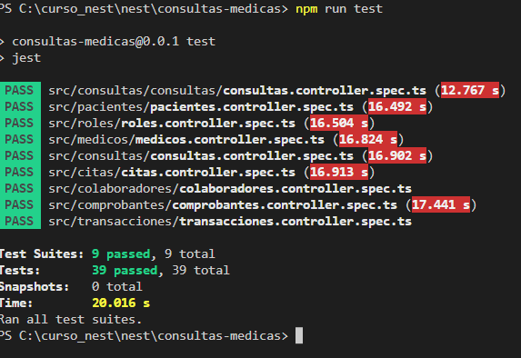

<p align="center">
  <a href="http://nestjs.com/" target="blank"></a>
</p>

# Ejecutar en desarrollo

1. Tener Nest CLI instalado
```
npm i -g @nestjs/cli
```

2. Clonar el repositoriop
```
git clone https://github.com/VazquezAriel/consultas-medicas.git
```

3. Ejecutar
```
npm install
```

4. Levantar la base de datos
```
docker-compose up -d
```

5. Ejecutar en modo desarrollo
```
npm run start:dev
```
6. Ejecutar test
```
npm run test
```

# Actividades Planificadas

1. Gerardo Guamani
 ```
- CRUD de usuarios que manejan el sistema(Colaboradores)
- Servicios de login
- Servicios de recuperar contraseña
```

2. Joseph Herrera
```
- CRUD de pacientes
- CRUD de doctores
- Servicio de emision de certificados medicos
```

3. John Farez
```
- CRUD de citas
- Servicio que mediante la cédula, retorne las citas atendidas, canceladas y pendientes.
- Servicio que devuelva un calendario de atencion.
```

4. Bryan Parra
```
- CRUD de consultas
- CRUD de prescripciones medicas.
- CRUD de ordenes medicas
```

5. Ariel Vazquez
```
- Creacion del proyecto, vinculacion con BD y despliegue
- CRUD de comprobantes
- CRUD de transacciones
```


# Stack usado
* Postgresql
* Nest
* Docker

# Ejecucion de las pruebas unitarias

<p align="left">
  
</p>

